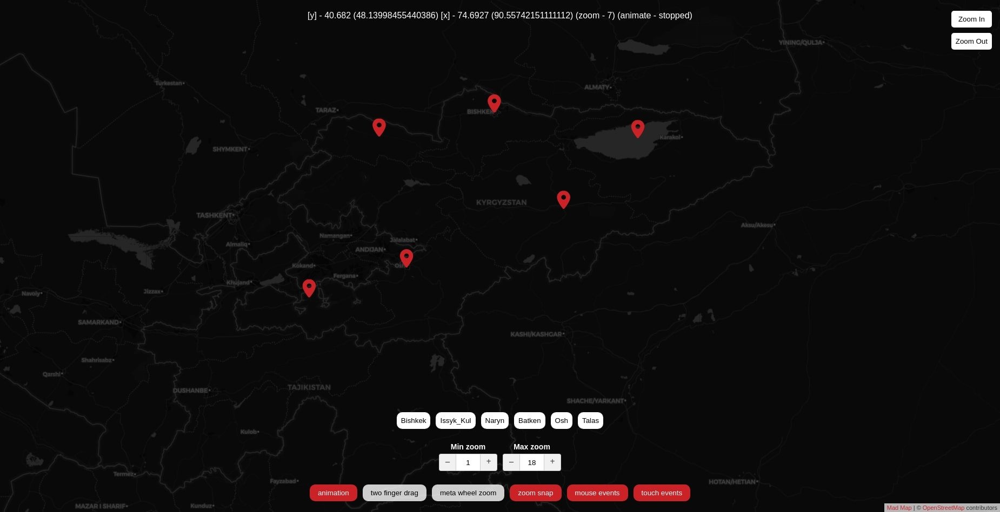

# Mad Map - Light React Map

&nbsp;

## Install:
    npm install --save react-mad-map

## Usage:
    import React, { Component } from 'react';
    import { Map, Marker } from 'react-mad-map';

    export default class App extends Component {
        ...
        this.state = {
            center: [40.682004, 74.692748],
            zoom: 7,
            metaWheelZoom: false,
            twoFingerDrag: false,
            animate: true,
            animating: false,
            zoomSnap: true,
            mouseEvents: true,
            touchEvents: true,
            minZoom: 1,
            maxZoom: 18
        }
        ...
        const markers = {
            Bishkek: [[42.883004, 74.582748], this.state.zoom],
            Issyk_Kul: [[42.499998, 77.499998], this.state.zoom],
            Naryn: [[41.42866, 75.99111], this.state.zoom],
            Batken: [[40.06259, 70.81939], this.state.zoom],
            Osh: [[40.52828, 72.7985], this.state.zoom],
            Talas: [[42.52277, 72.24274], this.state.zoom]
        }
        ...
        <Map
            center={this.state.center}
            zoom={this.state.zoom}
            // provider={(x, y, z) => {
            //   const s = String.fromCharCode(97 + (x + y + z) % 3)
            //   return `https://${s}.basemaps.cartocdn.com/dark_all/${z}/${x}/${y}.png` // List providers https://leaflet-extras.github.io/leaflet-providers/preview
            // }}
            // backgroundColor={'#fff'}
            dprs={[1, 2]}
            animate={this.state.animate}
            metaWheelZoom={this.state.metaWheelZoom}
            twoFingerDrag={this.state.twoFingerDrag}
            zoomSnap={this.state.zoomSnap}
            mouseEvents={this.state.mouseEvents}
            touchEvents={this.state.touchEvents}
            minZoom={this.state.minZoom}
            maxZoom={this.state.maxZoom}
            boxClassname="mad-map"
        >
            {Object.keys(markers).map(key => (
                <Marker key={key} anchor={markers[key][0]} payload={key} />
            ))}
        </Map>
        ...
    };

> More examples can be found in the demo/demo.js file
## Options:

### Map

**center** - Coordinates of the map center in the format `[lat, lng]`. Use if the component is controlled, e.g. you'll be listening to `onBoundsChanged` and passing a new `center` when the bounds change.

**defaultCenter** - Initial coordinates of the map center in the format `[lat, lng]`. Use if the component is uncontrolled.

**zoom** - Current zoom level, e.g. `12`, use for controlled components and update when `onBoundsChanged` give you a new value.

**defaultZoom** - The initial zoom for uncontrolled components.

**width** - Width of the component in pixels. Defaults to `100%` of the parent div if not set.

**height** - Height of the component in pixels. Defaults to `100%` of the parent div if not set.

**defaultWidth** - If you don't specify a `width`, we wait until the component is mounted and measure the container before rendering tiles, markers and other objects. Setting `defaultWidth` assumes a width and renders everything before mounting. If the actual width of the component differs, it will just be re-rendered. Use this for example to render tiles on server rendering, when `width` is not set.

**defaultHeight** - Similar as `defaultWidth`, but for the `height`.

**provider** - Function that returns a [TMS URL](https://wiki.openstreetmap.org/wiki/TMS): `(x, y, z, dpr) => url`. The argument `dpr` will be a value from the `dprs` array (see below) or `undefined` when requesting the default tile. List providers https://leaflet-extras.github.io/leaflet-providers/preview. `Important - rename {s},{z},{x},{y} to ${s},${z},${x},${y} for the arguments to be inserted into the link`

**dprs** - An array of `devicePixelRatio`s that your tile provider supports. Defaults to `[]`. Pass an array like `[1, 2]` and the numbers here will be sent to `provider` as the 4th argument. The responses will be combined into an `` attribute, which modern browsers use to select tiles with [the right resolution](https://developer.mozilla.org/en-US/docs/Learn/HTML/Multimedia_and_embedding/Responsive_images#Resolution_switching_Same_size_different_resolutions).

**animate** - Animations enabled, `true`.

**animateMaxScreens** - If an updated `center` prop is more than `animateMaxScreens` screens away, we will directly switch to it, otherwise smoothly animate to it. Defaults to `5`

**zoomSnap** - Snap to discrete zoom increments (14, 15, 16, etc) when scrolling with the mouse or pinching with touch events, Defaults to `true`.

**minZoom** - The lowest zoom level possible. Defaults to `1`

**maxZoom** - The highest zoom level possible. Defaults to `18`

**attribution** - What to show as an [attribution](https://www.openstreetmap.org/copyright). React node or `false` to hide.

**attributionPrefix** - Prefix before attribution. React node or `false` to hide.

**onClick** - When map is clicked `function ({ event, latLng, pixel })``

**onBoundsChanged** - When the bounds change, `function ({ center, zoom, bounds, initial })`. Use this for a controlled component, then set `center` and `zoom` when it's called. This callback also gets called on the initial mount (when the first bounds become known). In this case the prop `initial` will be set to `true`. It will be `false` on all subsequent calls.

**onAnimationStart** - Called when the map starts moving

**onAnimationStop** - Called when the map stops moving

**mouseEvents** - Can the user interact with the map with the mouse? Defaults to `true`.

**touchEvents** - Can the user interact with the map by touching it? Defaults to `true`.

**metaWheelZoom** - Zooming with the mouse wheel only works when you hold down the `meta` (cmd/win) key. Defaults to `false`.

**metaWheelZoomWarning** - Warning text to show if scrolling on a map with `metaWheelZoom` enabled, but without the meta key. Defaults to `Use META+wheel to zoom!`, where `META` is automatically replaced with either "⌘" or "⊞", depending on Mac vs non-Mac. Set to `null` to disable.

**twoFingerDrag** - Moving the map requires touching with two fingers. Defaults to `false`.

**twoFingerDragWarning** - Warning to show when `twoFingerDrag` and you try to move the map with one finger. Defaults to `Use two fingers to move the map`. Set to `null` to disable.

**warningZIndex** - The `z-index` value for the meta warning. Defaults to `100`

**boxClassname** - The classname for the tiles div, allowing you to style it with a filter css property without impacting the overlays.

**backgroundColor** - Background color behind the map. Default `#fff`

### Overlays

`<Map />` takes random React components as its children. The children may have these special props:

**anchor** - At which coordinates `[lat, lng]` to anchor the overlay with the map.

**offset** - Offset in pixels relative to the anchor.

The children get passed these special props:

**left** - Pixels from the left of the map, calculated from `anchor` and `offset`

**top** - Pixels from the top of the map, calculated from `anchor` and `offset`

**mapState** - An object `{ center, zoom, bounds, width, height }` that gets updated at every animation frame.

**latLngToPixel** - A helper `function (latLng, center, zoom)` that returns the position in pixels `[x, y]` for any `[lat, lng]`. The last 2 arguments are optional.

**pixelToLatLng** - A helper `function (pixel, center, zoom)` that converts any pixel coordinates `[x, y]` to `[lat, lng]`. The last 2 arguments are optional.

### Markers

**icon** - link to custom icon for pin `import pin from '../img/pin.svg'`.

**payload** - Coordinates `[[lat, lng], zoom]` marker

**width** - Width custom marker. Default `20`

**height** - Height custom marker. Default `29`